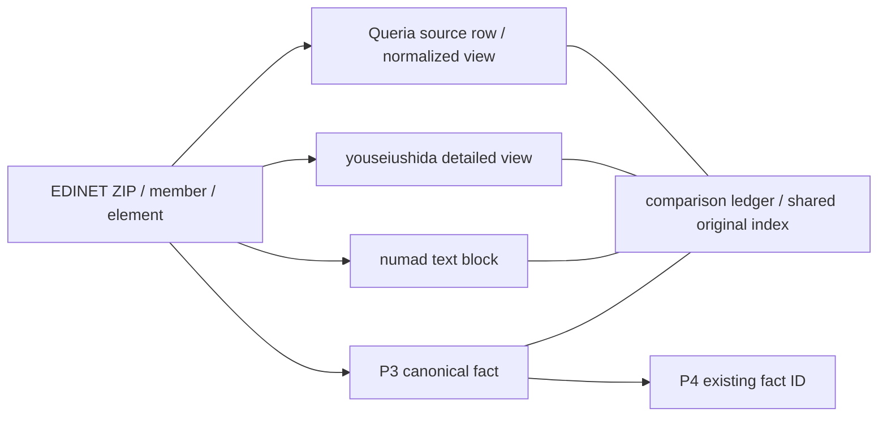

# P5: EDINET派生データの受入と原本別比較

P5はQueria、youseiushida/edinet、numadの限定受入だけを行う。
P3 canonical fact・訂正系列・null・未対応mappingを変更しない。P4への接続キーは既存のentity/doc/fact IDであり、
現在の企業マスタを過去の証券有効期間として使わない。return、投資分析、増分予測評価、P6は対象外。

## 関係モデル

実データの依存関係は原本を中心とする分岐であり、3提供者を順に処理したという架空の鎖にはしない。



`source_class`はofficial_original / derived_from_edinet / independent_externalを区別する。
3ソースはいずれもderived_from_edinet。doc_id＋原本ZIP SHAの同一groupへのmirror追加は独立証拠を0件加算する。
official_originalは既存ローカル原本の内容とlineageを指し、今回公式APIで取得したという意味ではない。
syntheticは別フラグで、実データの受入へ昇格させない。

## 版と受入範囲

| ソース | 固定した証拠 | 用途・制限 |
|---|---|---|
| Queria | DuckLake catalog全バイトSHA＋snapshot 7428、Parquet行/範囲hash。参照コードcommit `4844ff654235d087d2cbd7521cd3c05af481ac15` | mart_companies、mart_documents、mart_business_results、stg_financial_facts相当。データbuild commitは不明のまま |
| youseiushida/edinet | dataset-v2 / asset 375969107 / 2022-H1 / type120。tag commit `70f9a20ddc685283b06e68ef15132e6b81ea59c3` | filings、line_items、contexts、text_blocks、dei、calc_edges、def_parents。全release検証ではない |
| numad | commit `e1dd7e00d5de82aa1b00cf7a28c829d327a93ca7`、yuho-2022.jsonl既存4MiB prefix | 完全なJSONL行だけ使用。末尾の不完全行を除き、全年度カバレッジへ外挿しない |

参照元は[Queria dataset](https://github.com/queria-io/dataset-edinet)、
[youseiushida release](https://github.com/youseiushida/edinet/releases/tag/dataset-v2)、
[numad dataset card](https://huggingface.co/datasets/numad/yuho-text-2014-2022/blob/e1dd7e00d5de82aa1b00cf7a28c829d327a93ca7/README.md)。
source別の文書取得、文書レビュー、実バイト取得、schema、原本対応、rightsは私有source_acceptanceで別状態にする。
提供者の収録説明は主張として保存し、今回測定したrow count・標本内日付範囲・schemaと混同しない。

### Documentationの取得とレビュー

`docs fetched != docs checked`。文書が存在するだけでは仕様として採用しない。
[review registry](../registry/p5_documentation_reviews.json)は、取得処理と独立して管理する。
Queria 4文書・youseiushida 3文書・numad 1文書について、固定URL、byte SHA-256、参照commit、
レビュー範囲、既知の制約、実際に採用したassertionを記録した。レビュー範囲外の説明を承認したことにはならない。

| 独立状態 | PASSの意味 |
|---|---|
| documentation_fetched | 入力manifestに列挙された文書バイトが存在し、取得時hash/countと一致。必須文書の完全性やレビュー済みの意味ではない |
| documentation_checked | 必須文書が揃い、固定URL・版・実測byte SHAが明示的レビューと一致し、scope・assertion・制約が記録済み |
| data_fetched | 限定標本の派生元行を取得済みバイトから再読・検証できた |
| schema_profiled | 取得対象のschema profileが存在する |
| original_tied | 限定標本に原本要素との正の照合が存在する。全行成功の意味ではない |
| rights_reviewed | 今回は常にBLOCKED。export_allowed=falseを維持 |

hash未登録・変更、必須文書欠落、scope不明、版/locator不一致や重複候補はchecked=BLOCKED。
破損・欠損文書も例外終了で隠さず、`documentation_review.missing_reasons`と文書別のバイト証拠へ残す。
文書のBLOCKEDで既存の原本照合結果を書き換えず、文書のPASSでもデータ・rightsを昇格させない。
旧名docs_checked/file_fetched/original_fact_tiedはそれぞれ新状態と同値の互換aliasだけを残す。

変更文書を採用する際は、固定バイトを読み、scope/assertion/制約とexpected SHAを明示的に更新してレビューする。
取得コードや監査コードからreview registryを自動生成・追記する経路はない。
registryの内容hashは各sourceへ、ファイルのbyte hashとregistry本体は私有snapshotへ保存する。
参照コードcommitとデータbuild版は別であり、Queriaの不明なbuild commitを補わない。
ライセンス文書のレビューは表示・適用対象の識別に限定し、法的な権利判断を含まない。

Queriaのstgは公開catalogのcompiled SQLを保存し、その元financial_facts Parquetからvalue/contextを直接投影する。
提供者コードやSQLを実行して原本を生成しない。元のrow locatorを維持し、文書対応は別のmart_documents行で確認する。
mart_business_resultsは実際の公開Parquet行を読む。限定10列のcomponent候補を明示的なSQL定義に沿って辿り、
複数候補をmax・平均で解消しない。IFRS/JP GAAPをまとめた提供者の値はprovider_normalized_viewのまま保持する。

tar全体は取得せず、検査済みheaderから選択テーブルのParquet footer・対象row groupだけを取得する。
Content-Range、範囲サイズ、ETagの一貫性を検査し、**取得した各範囲のバイトSHA**を保存する。
range-setを全tar/全ParquetのSHAとして扱わない。提供者が表示する全release SHAも「提供者の主張」であり、実測済みへ昇格させない。
再監査は保存範囲だけで実行し、穴があればnetworkへ補完せずBLOCKEDとする。

## 識別・意味・時点

名前joinは禁止。doc_idを必須とし、存在するEDINET code、文字列sec_code、期間、提出日時、親書類・statusを照合する。
複数文書行や識別子不一致を任意選択しない。null証券コードの非上場提出者も、doc_id/EDINET codeと公式metadataで追跡できる。
提出日時は元metadataと共通の精度で比較し、提供者の日単位表示に架空の秒精度を付けない。

XBRL数値は実memberのQName、contextRef、unitRef、期間、entity、dimensions、nilと照合する。
Queriaのprefix QNameは原本内の実namespace束縛で解決する。類似タグや企業名では解決しない。
文章は原文hashと、HTML本文抽出・空白除去による決定論的な正規化結果で比較する。
元の各提供者本文は私有observationsに残す。複数member/context候補を一つへ潰さない。

calcはZIP内の実linkbase、role、href、weight、orderへ戻す。def_parentsのlocal-nameだけのflattened viewは、
QName・role・元の関係経路が不足するためunresolved。原本arc候補のlocatorだけを残し、canonical mappingを追加しない。
未対応dimensionや企業独自要素が原本と一致しても、P3の未対応状態や意味の定義を解除しない。

`public_available_at`は**原書類のP3公開時刻**。派生datasetの過去配信時刻はprovider_available_at=null＋理由で保存する。
比較値を対象年度の開始時点へ戻さない。原本取得時刻、今回の派生バイト取得時刻、provider releaseを分ける。
provider/system replayはNOT ESTABLISHED。今回の比較結果をそのまま過去のPIT featureとして採用する処理は追加しない。

比較分類はexact_match / extraction_difference / context_difference / unit_difference / scope_difference /
revision_difference / text_difference / missing_in_source / unresolved。
原本の候補なしと、未取得のtableと、範囲内での欠損を区別する。差異の件数は提供者の誤り率ではない。

## 私有実行

Python 3.12の私有環境でoptional依存を導入する。公開CIは標準ライブラリと合成fixtureのみで動く。

```sh
python -m pip install --require-hashes -r requirements-p5-audit.lock
python p5_collect.py --p3-snapshot /absolute/private/p3/snapshot --numad-store /absolute/private/p2-inputs --private-dir /absolute/private/p5-inputs
python p5_audit.py --edinet-local-root /absolute/private/edinet --p3-snapshot /absolute/private/p3/snapshot --input-dir /absolute/private/p5-inputs --private-dir /absolute/private/p5 --snapshot new-unique-snapshot
python -m unittest discover -s tests -v
```

collectorのselection.jsonは値を比較する前に固定する。P3の2022-H1有報と固定numad prefixのdoc_id共通集合をソートし、先頭3件を使う。
取得途中はバイトcheckpointを再利用する。完成bundleと過去audit snapshotは上書きしない。
認証なし公開取得だけを使用し、EDINET API・J-Quants API・secretは呼ばない。
入力原本はread-only。出力先がGit checkout内や入力配下なら拒否する。

| 私有成果物 | 内容 |
|---|---|
| audit_plan.json / definitions.json | 固定選択・code SHA・親P3 snapshot・比較規則 |
| source_acceptance.json / source_artifacts.json | 版、文書/ライセンス表示、schema、観測範囲、バイト証拠、限界 |
| documentation_review_registry.json | 今回適用したreview registry本体とファイルbyte hash。各sourceの判定証拠はsource_acceptanceに保存 |
| derived_observations.jsonl | 元行・元値/本文・物理row group/行番号・source row hash |
| official_observations.jsonl / original_artifacts.jsonl | 元ZIP/member/要素/context/関係とhash・取得経路 |
| metadata_proofs.jsonl / document_links.jsonl | 公式日次JSONへの対応と各ソースの識別子検査 |
| canonical_fact_references.jsonl | 既存P3 fact ID・元fact・hash。理由付きnullも保持 |
| comparison_ledger.jsonl / source_matrix.jsonl | 書類×source×tableの一致・差異・欠損理由 |
| lineage.jsonl / shared_original_views.jsonl | 派生行から原本、および原本から各派生viewへの逆引き |
| failure_ledger.jsonl / coverage_summary.json | 分類別集計と未解決事項 |
| preservation_proof.json | P3・派生入力・読み出したEDINETのbytes/hash/mtime不変 |

全audit成果物にsnapshot ID、code SHA、定義版、synthetic、rightsを付ける。
将来CUC等を追加する際は、source別schema/物理row readerとadapterを追加し、共通原本index・比較・証拠groupを再利用する。
EDINET由来の新しいmirrorもindependent_externalへ分類しない。人的資本等の意味の定義は別の受入として追加する。

## 限定受入結果

私有snapshotは`p5-derived-20260918-v4`。code bundle SHAは`d654156828e0a04886a7a04a6db61553efa34c142bcfda45a5cffea391c23393`。
既存242＋追加34＝276テストがofflineで成功。CIの確定結果はPRのOffline unit testsを参照する。
P3 207ファイル、派生入力394ファイル、読み出したEDINET 6ファイルのbytes/hash/mtime不変を確認した。

3書類・3提出主体、10,349派生行を選択。取得バイトから全行のschema・物理locator・行hashを再読して検査した。
原本要素18件について3提供者のviewへ相互に辿れる（全viewの値が一致したという意味ではない）。
既存P3 canonical fact 712件へ接続し、値・定義・訂正版・BLOCKED状態は変更していない。

| source | exact_match | extraction_difference | unit_difference | missing_in_source | unresolved |
|---|---:|---:|---:|---:|---:|
| Queria | 3,111 | 325 | 932 | 30 | 270 |
| youseiushida | 5,527 | 0 | 0 | 0 | 289 |
| numad | 18 | 3 | 0 | 0 | 0 |

比較は行/field単位を含むため、元行数とは分母が異なる。exact_matchにはmetadata/context/関係も含み、独立した金融指標数ではない。
Queriaのunit_differenceは、原本にunitRefがない要素に対するCSVの表示用単位マーカーとの差。
nilとの差も提供者の欠損文字列表現を勝手に解釈せず残したもので、真の数値矛盾や誤り率へ読み替えない。
unresolved 559件は複数原本要素候補540、複数context候補6、flattened定義関係13。
numadの3件は対応する原本要素が見つからず、他の書類から補っていない。

rights reviewはBLOCKED、export_allowed=false。
QueriaのJP-FSA-EDINET表示、numad dataset cardのApache-2.0表示、youseiushidaのソフトウェアAGPL-3.0-or-later表示は、
それぞれの資料hashとともに保持する。EDINET原資料の条件とは分け、再配布許可を推測しない。
全source本番採用・全量監査・全市場代表性・投資分析・P6の成功は主張しない。

### Documentation受入の再監査

新しい私有snapshot `p5-documentation-review-20260918-v1`で既存入力だけを再監査した。
code bundle SHAは`fb9b325ef72d1d19a3817f77015c2f690827421e758f6e0d223bfbf1bb1b8647`。
3ソースともdocumentation_fetched / documentation_checked / data_fetched / schema_profiled /
original_tiedは限定範囲でPASS、rights_reviewedはBLOCKED、export_allowed=false。

既存276＋文書受入15＝**291テストPASS**。取得だけ・hash未登録/変更・破損・必須文書欠落・scope不明・
版/URL/文書名の不一致・重複候補・異なるsourceのレビュー・他状態の非昇格を合成fixtureで検査する。
最新commitのOffline CIはPR上で別途確認する。

`acceptance_preservation_proof.json`に旧snapshotとの15成果物の意味内容一致を記録した。
比較から除外するのは各行の最上位snapshot_id/code_shaだけで、原本照合IDやP3内部値は除外しない。
10,349派生行、比較台帳、P3 canonical参照、原本locator、mirror証拠規則と集計は不変。
既存入力のbytes/hash/mtimeと旧snapshotも不変で、新規取得・権利状態の変更は行っていない。
